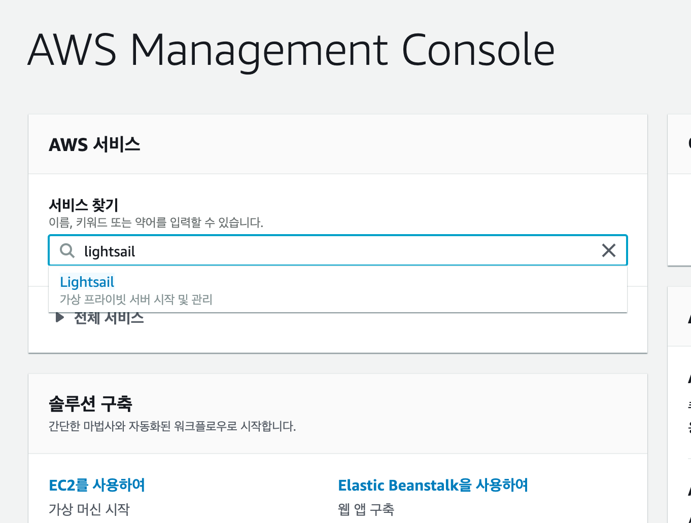
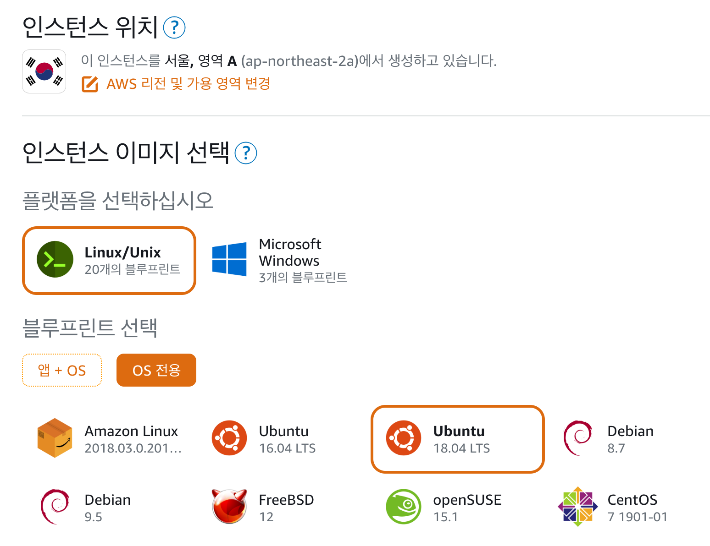
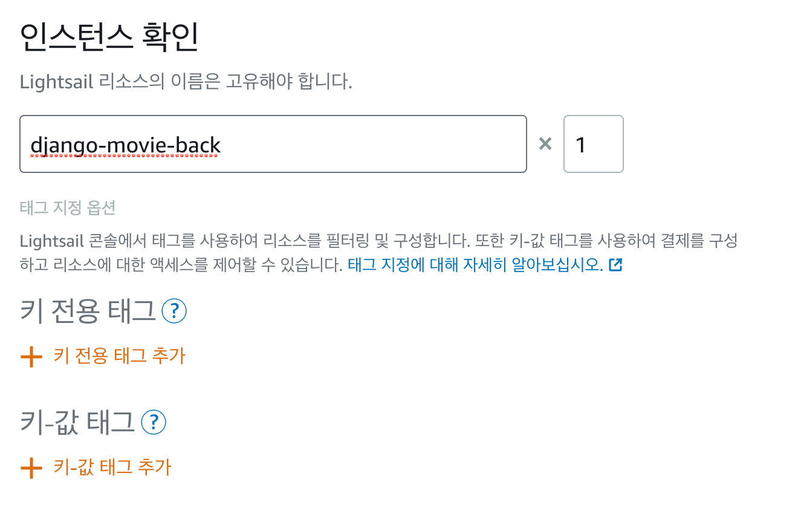
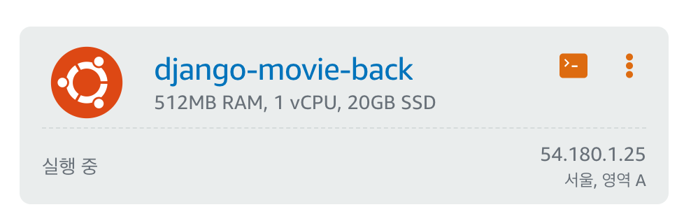
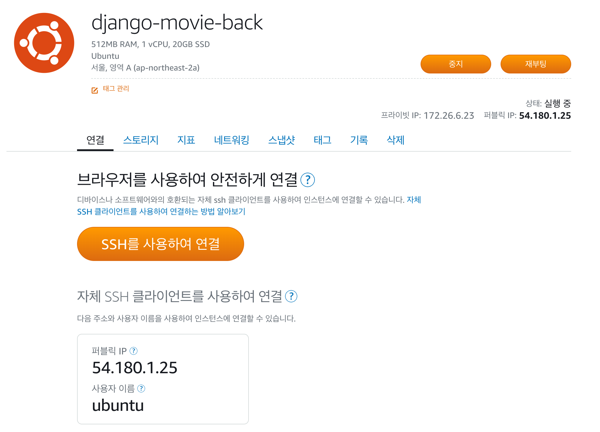
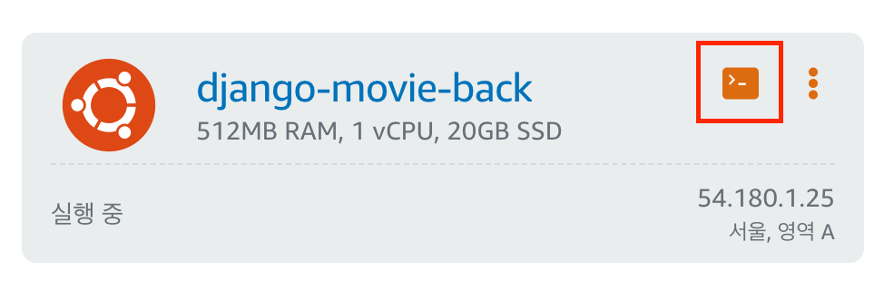
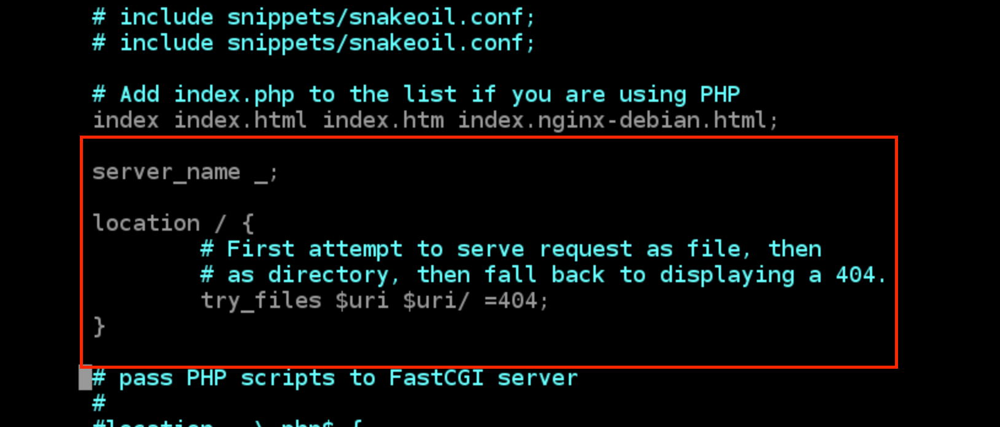
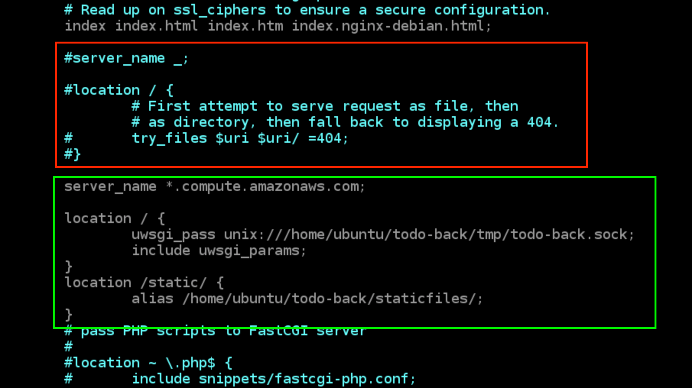

# Backend Deploy

## lightsail 설정

### 0. 준비

- 완성된 django 프로젝트
- 해외결제가 가능한 체크카드 or 신용카드
- 여유로운 마음

### 1. https://aws.amazon.com/ko/

- AWS 계정 생성
- 기본정보입력
- 카드정보입력
- 휴대폰인증
- 완료후 로그인

### 2. Lightsail 인스턴스 생성

- AWS Management Console 에서 lightsail 검색




- 인스턴스 옵션 설정 (우측 하단의 언어설정 후 진행)




- 플랜 선택


- 이름 설정 후 인스턴스 생성 버튼 클릭



- 대기 중 => 실행 중 으로 바뀐것 확인 후 진행 (약 1~3분 후 새로고침)




- 서버이름 클릭 후 퍼블릭 IP 확인




- 퍼블릭 IP 여기에 적어두기

```

```


## Django 설정

### 0. 준비

- decouple 설치

```shell
pip install python-decouple
```


### 1. git

> git 설정이 되어있다면 스킵

- 깃 폴더 생성

```shell
git init
```

- `.gitignore` 파일 생성 후 제외할 파일,폴더 등록

```shell
touch .gitignore
```

- 커밋생성

```shell
git add .
git commit -m "first commit"
```


### 2. 가상환경 설정

> 가상환경 설정이 되어있다면 스킵

- 프로젝트 폴더 내부에 가상환경 폴더 생성

```shell
# python -m venv {가상환경폴더이름}
python -m venv venv
```

- 가상환경 활성화

```python
# source {가상환경폴더이름}/Scripts/activate
source venv/Scripts/activate
```

- 설치되어있지 않은 모듈설치

```shell
# pip install {모듈1} {모듈2} ...
pip install django
```

- 서버가 실행되는지 확인

```shell
python manage.py runserver
```


### 3. settings.py 분리

> 루트폴더와 프로젝트, 두개의 폴더 이름에 주의하며 진행해주세요.
>
> 배포설정과 개발설정이 달라서 폴더를 분리해야한다.

- 기존폴더구조

```
{루트폴더}
	{프로젝트}
		settings.py
		urls.py
		wsgi.py
	{앱1}
	{앱2}
	manage.py
```

- 변경된 폴더구조 (기존의 `settings.py`를 `base.py`로 변경, `.env`생성)

```
{루트폴더}
	{프로젝트}
		settings
			__init__.py
			base.py
			local.py
			production.py
		__init__.py
		urls.py
		wsgi.py
	{앱1}
	{앱2}
	manage.py
	.env
```


- `.env` 파일생성 후 `base.py`의 SECRET_KEY 등록
  - `=`기호 사이에 공백 없음
  - `manage.py` 와 같은 위치
  - `.gitignore` 에 `.env` 추가

```
SECRET_KEY='{base.py의 SECRET_KEY}'
```


- `base.py`  (개발에서의 settings.py)

```python
# 기존의 settings.py에서 DEBUG, ALLOWED_HOSTS 삭제

from decouple import config
SECRET_KEY = config('SECRET_KEY')

# BASE_DIR = os.path.dirname(os.path.dirname(os.path.abspath(__file__))))
BASE_DIR = os.path.dirname(os.path.dirname(os.path.dirname(os.path.abspath(__file__))))

```

- `local.py`

```python
from .base import *

DEBUG = True

ALLOWED_HOSTS = []
```

- `production.py`

```python
from .base import *

DEBUG = False

ALLOWED_HOSTS = [
    '.compute.amazonaws.com',
    '{Lightsail 퍼블릭 IP}',
]
```


- `manage.py`

```python
def main():
    os.environ.setdefault('DJANGO_SETTINGS_MODULE', '{프로젝트}.settings.local')
```

- `wsgi.py`
  - WSGI(Web Server Gateway Interface) : 파이썬에서 정의된(PEP) 웹 서버 관련 인터페이스

```python
os.environ.setdefault('DJANGO_SETTINGS_MODULE', '{프로젝트}.settings.production')

```


- 서버가 실행되는지 확인 (에러 발생시 migrations 파일 삭제 후 다시 makemigrations)

```shell
python manage.py runserver
```


### 4. 추가설정

- `base.py` 에 staticfiles 경로 추가

```python
STATIC_ROOT = os.path.join(BASE_DIR, 'staticfiles')
```

- `.gitignore` 에 `staticfiles` 폴더 추가

```
...
staticfiles/
```

-  라이브러리 의존성 저장

```shell
pip freeze > requirements.txt
```


### 5. 원격저장소로 업로드

- 지금까지 작성한 코드 커밋

```shell
git add .
git commit -m "deploy setting"
```

- 원격저장소 push

```shell
git push origin master
```

- 원격저장소 주소 복사해서 넣어두기

```

```


## 서버 환경 설정

### 0. lightsail 접속

- Ubuntu  선택하고 create 하면 서버가 만들어진다
- 새로고침하면 서버주소 나오고
- 아래 빨간상자 누르면 서버에 접속이 된다!



### 1. 필요한 라이브러리 설치

> 그대로 복사 붙여넣기  <=  우측 하단의 클립보드?에 복사해 넣고 터미널 우클릭해서 붙여넣기 버튼 하면 보라색 화면 나온다.

- 서버에서 필요한 라이브러리
  - 중간에 사용자 입력 받는 화면은 enter버튼으로 넘어가기 (default 설정으로)

```shell
sudo apt-get update
sudo apt-get install -y make build-essential libssl-dev zlib1g-dev libbz2-dev
```

```shell
sudo apt-get install -y libreadline-dev libsqlite3-dev wget curl llvm libncurses5-dev libncursesw5-dev
```

```shell
sudo apt-get install -y xz-utils tk-dev libffi-dev liblzma-dev python-openssl
```

=> NO !! => enter, enter

- pyenv & pyenv-virtualenv 설치

```shell
git clone https://github.com/pyenv/pyenv.git ~/.pyenv
echo 'export PYENV_ROOT="$HOME/.pyenv"' >> ~/.bashrc
echo 'export PATH="$PYENV_ROOT/bin:$PATH"' >> ~/.bashrc
echo -e 'if command -v pyenv 1>/dev/null 2>&1; then\n  eval "$(pyenv init -)"\nfi' >> ~/.bashrc
exec "$SHELL"

git clone https://github.com/pyenv/pyenv-virtualenv.git $(pyenv root)/plugins/pyenv-virtualenv
echo 'eval "$(pyenv virtualenv-init -)"' >> ~/.bashrc
exec "$SHELL"
```


- python 설치 후 전역 등록, 확인

```shell
pyenv install 3.7.4
pyenv global 3.7.4
python -V
#=> Python 3.7.4
```


- 가상환경 생성

```shell
pyenv virtualenv {가상환경이름}
```


### 2. 원격저장소 clone

> 루트폴더와 프로젝트, 두개의 폴더 이름에 주의하며 진행해주세요.
>
> 두 폴더의 이름을 통일하면 조금더 편하게 설정할 수 있습니다.

- clone

```shell
cd ~
git clone venv(가상환경 이름)
```

- 폴더구조( 이름 기억하기! )

```
home
	ubuntu
		Project-movie(루트폴더) (git 이름에 따라 다르겠지) // ls했을 때 manage.py가 있어야해
			lastProject(프로젝트) - settings 폴더 있는 폴더
			{앱}
			manage.py
```

- 프로젝트루트로 들어가기

```shell
cd Project-movie(루트폴더)
```

- 가상환경 활성화

```shell
pyenv local venv(가상환경 이름)
```

- 파이썬 라이브러리 설치

```shell
pip install -r requirements.txt

vi requirements.txt
django-heroku 위에서 dd
psycopg2 위에서 dd 눌러 삭제
esc + :wq 로 밖으로
```

- `.env` 생성 후 SECRET_KEY 입력

```shell
touch .env
vi .env
실제 env 파일내용 넣기
```

- 마이그레이션

```
python manage.py migrate
```

- createsuperuser

```shell
python manage.py createsuperuser
```

- collectstatic

```
python manage.py collectstatic
```


### 3. nginx

* 요청이 들어오면 장고가 받기 전에 nginx가 요청을 받아 뿌려줄 것이다.

- 설치

```shell
sudo apt-get update
sudo apt-get install -y software-properties-common nginx
```

- 설정파일 열기

```shell
sudo vi /etc/nginx/sites-enabled/default
```

- `/etc/nginx/sites-enabled/default`

```
server_name *.compute.amazonaws.com;

location / {
		uwsgi_pass unix:///home/ubuntu/{루트폴더}/tmp/{루트폴더}.sock;
		include uwsgi_params;
}

location /static/ {
	alias /home/ubuntu/{루트폴더}/staticfiles/;
}
```

- 위의 설정에서 {루트폴더}를 자신의 폴더 이름(Project-movie)으로 수정후 아래에 복사

```
server_name *.compute.amazonaws.com;

location / {
		uwsgi_pass unix:///home/ubuntu/Project-movie/tmp/Project-movie.sock;
		include uwsgi_params;
}

location /static/ {
	alias /home/ubuntu/Project-movie/staticfiles/;
}
```

- 아래의 이미지 부분을 수정



- 수정 후 




### 4. uWSGI

- 설치

```shell
pip install uwsgi
```

- 프로젝트 폴더로 이동

```shell
cd ~/{루트폴더}
```

- uwsgi 설정, 로그 저장할 폴더 생성

```shell
mkdir tmp
mkdir -p log/uwsgi
mkdir -p .config/uwsgi/
```

- uwsgi 설정파일 생성

```shell
touch .config/uwsgi/{프로젝트}.ini
```

- `.config/uwsgi/{프로젝트}.ini` 설정파일 수정

```shell
vi .config/uwsgi/{프로젝트}.ini
```

```
# {루트폴더}/.config/uwsgi/{프로젝트}.ini

[uwsgi]
chdir = /home/ubuntu/{루트폴더}
module = {프로젝트}.wsgi:application
home = /home/ubuntu/.pyenv/versions/{가상환경이름}

uid = ubuntu
gid = ubuntu

socket = /home/ubuntu/{루트폴더}/tmp/{루트폴더}.sock
chmod-socket = 666
chown-socket = ubuntu:ubuntu

enable-threads = true
master = true
vacuum = true
pidfile = /home/ubuntu/{루트폴더}/tmp/{루트폴더}.pid
logto = /home/ubuntu/{루트폴더}/log/uwsgi/@(exec://date +%%Y-%%m-%%d).log
log-reopen = true
```

- 자신의 프로젝트 이름게 맞게 수정후 아래에 붙여넣기

```
# Project-movie/.config/uwsgi/lastProject.ini

[uwsgi]
chdir = /home/ubuntu/Project-movie
module = lastProject.wsgi:application
home = /home/ubuntu/.pyenv/versions/venv

uid = ubuntu
gid = ubuntu

socket = /home/ubuntu/Project-movie/tmp/Project-movie.sock
chmod-socket = 666
chown-socket = ubuntu:ubuntu

enable-threads = true
master = true
vacuum = true
pidfile = /home/ubuntu/Project-movie/tmp/Project-movie.pid
logto = /home/ubuntu/Project-movie/log/uwsgi/@(exec://date +%%Y-%%m-%%d).log
log-reopen = true
```


- daemon 설정파일 생성

```shell
touch .config/uwsgi/uwsgi.service
vi .config/uwsgi/uwsgi.service
```

- `.config/uwsgi/uwsgi.service` 설정파일 수정

```
[Unit]
Description=uWSGI Service
After=syslog.target

[Service]
User=ubuntu
ExecStart=/home/ubuntu/.pyenv/versions/{가상환경이름}/bin/uwsgi -i /home/ubuntu/{루트폴더}/.config/uwsgi/{프로젝트}.ini

Restart=always
KillSignal=SIGQUIT
Type=notify
StandardError=syslog
NotifyAccess=all

[Install]
WantedBy=multi-user.target
```

- 자신의 프로젝트 이름게 맞게 수정후 아래에 붙여넣기

```
[Unit]
Description=uWSGI Service
After=syslog.target
[Service]
User=ubuntu
ExecStart=/home/ubuntu/.pyenv/versions/venv/bin/uwsgi -i /home/ubuntu/Project-movie/.config/uwsgi/lastProject.ini

Restart=always
KillSignal=SIGQUIT
Type=notify
StandardError=syslog
NotifyAccess=all

[Install]
WantedBy=multi-user.target
```


- 심볼릭링크 생성

```shell
sudo ln -s ~/{루트폴더}/.config/uwsgi/uwsgi.service /etc/systemd/system/uwsgi.service

sudo ln -s ~/Project-movie/.config/uwsgi/uwsgi.service /etc/systemd/system/uwsgi.service
```

- deamon 등록 (전체 복사 붙여넣기)

```shell
# daemon reload
sudo systemctl daemon-reload

# uswgi daemon enable and restart
sudo systemctl enable uwsgi
sudo systemctl restart uwsgi.service

# check daemon
sudo systemctl | grep nginx
sudo systemctl | grep uwsgi

# nginx restart
sudo systemctl restart nginx
sudo systemctl restart uwsgi
```


## 배포확인

> lightsail의 퍼블릭IP를 통해 접속

